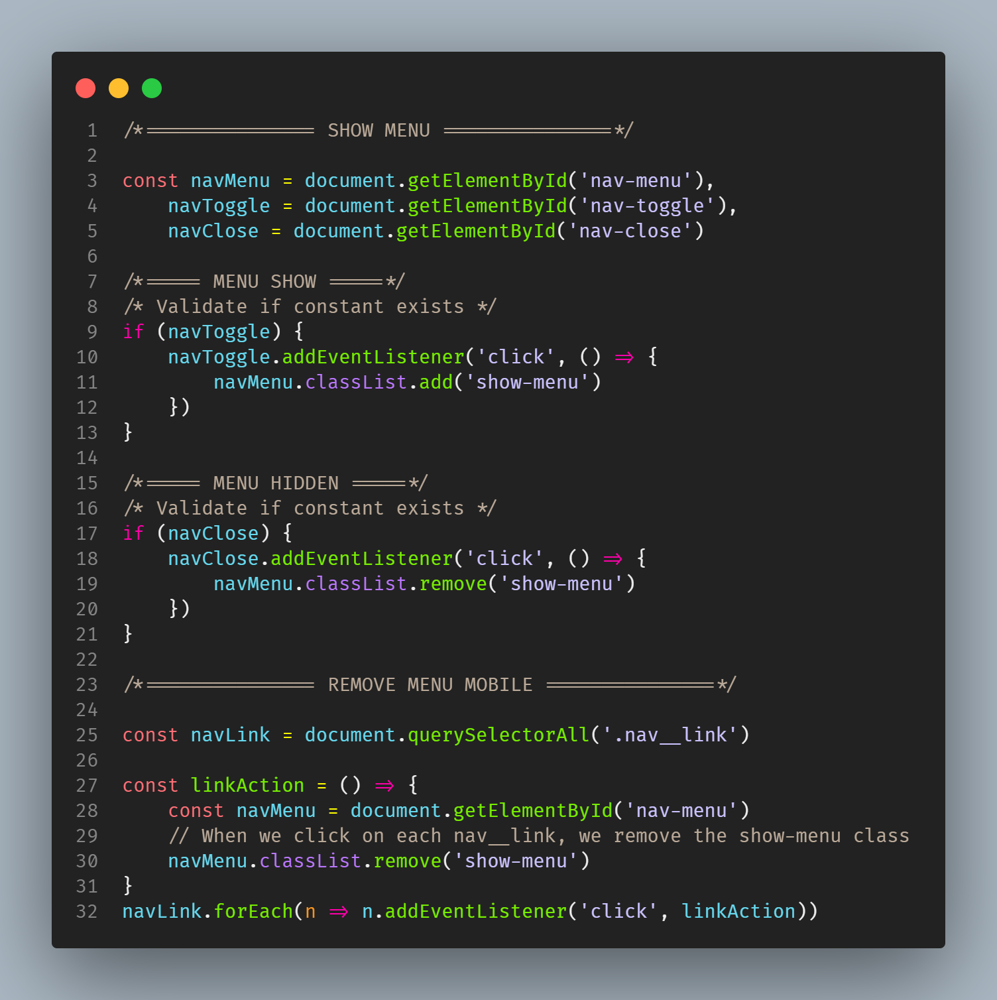
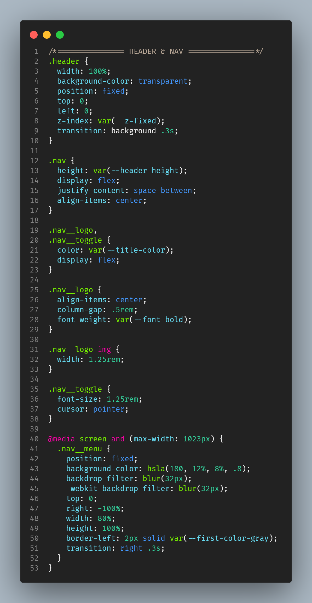
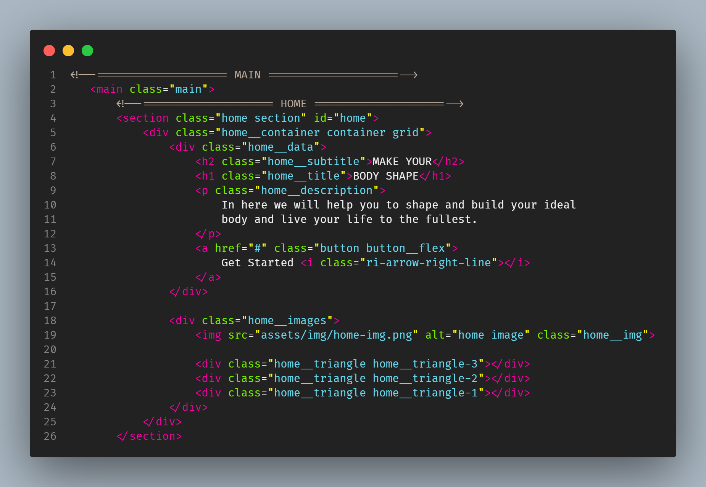

# NERO THEME

A bright colorful theme to brighten dark spaces or for night coding may be the ideal solution to create a cozy and cheerful atmosphere. The vibrant hues and background light tones allow the environments to be more lively even at night, giving users a unique and unforgettable experience.
[Theme](https://marketplace.visualstudio.com/items?itemName=Fe13rodrigues.nero-theme&ssr=false#review-details) by [Fernando Rodrigues](https://github.com/Fe7rodrigues).

## Installation
Launch VS Code, quick open `Ctrl+P`, paste the following command, and press enter.

```
ext install nero-theme
```
## Screenshots:

### JS code examples:
<p align="center">

</p>

### CSS example:
<p align="center">

</p>

### HTML example:
<p align="center">

</p>

## License
[MIT License](https://github.com/Fe7rodrigues/nero-theme/blob/main/License)
